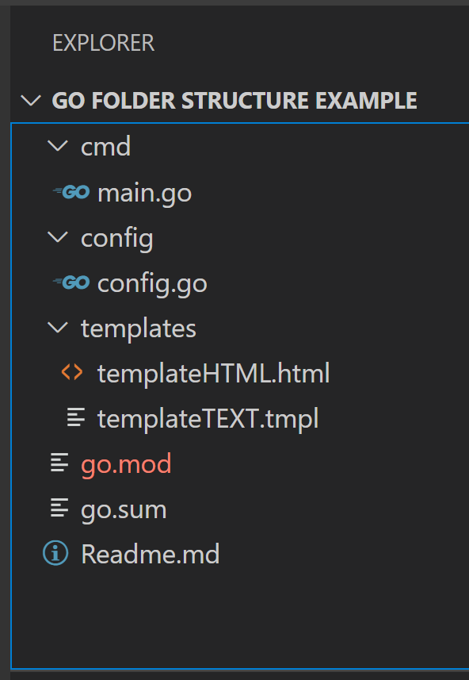

# Notificator Package
## Readme version: v.0.0.1
<br/>

>### package notificator ("bitbucket.org/teavaro/go-bdado/pkg/notificator")

<br/>

### The *Notificator* package receive the information of the mail configuration and the name of the configuration file and return an instance of notificator. <br/>

### *Notificator* support the reading of files with JSON formatted information related with email data. 
<br/>

#### **config.json**
```json
{
  "mail":{
	"sender":"support@teavaro.com",
	"receivers":[
		"johndoe@teavaro.com",
		"janedoe@gmail.com"
    ],
	"port":"25",
	"host":"localhost",
	"tls": false
  }
}
```

### *Notificator* core code, reserves the creation of *MailConfig* and *Instance* structures in order to setup the sender functions. 

```go
package notificator

type (
    MailConfig struct {
        Sender       string   `json:"sender"`
        Receivers    []string `json:"receivers"`
        SmtpHost     string   `json:"host"`
        SmtpPort     string   `json:"port"`
        SmtpPassword string   `json:"password"`
        UseTls       bool     `json:"tls"`
    }

    Instance struct {
        lastErrorMails time.Time
        smtpHost       string
        smtpPort       string
        smtpPassword   string
        useTls         bool
        sender         string
        receivers      []string
        filename       string
    }
)

func GetInstance(mailConfig *MailConfig, filename string) *Instance {
    once.Do(func() {
        n = &Instance{
            smtpHost:     mailConfig.SmtpHost,
            smtpPort:     mailConfig.SmtpPort,
            smtpPassword: mailConfig.SmtpPassword,
            useTls:       mailConfig.UseTls,
            sender:       mailConfig.Sender,
            receivers:    mailConfig.Receivers,
            filename:     filename,
        }
    })
    return n
}

```
### Next, we explain how set up and use the package. In the example, we use a distributed packages structure to organize the code
<br/>

<div style="width: 250px">
    
</div>

<br/>

* Setup the MailConfig instance from the configuration file in your config package

```go
package config

import (
   "bitbucket.org/teavaro/go-bdado/pkg/notificator"
)

type (
    Config struct {
        Mail         notificator.MailConfig `json:"mail"`
        // any other config declaration
    }
)
```

* Setup the Instance at an environment struct or any other field pointing to *notificator.Instance in your handler package
  
```go
package main

type (
    environment struct {
      notificator   *notificator.Instance
	  // any other env declaration
    }
)
```

* Parse the configuration file in order to create all the environments variables
  
```go
package main

import (
   "bitbucket.org/teavaro/go-bdado/netsales-process-report/pkg/config"
)

configFlag := flag.String("config", "config.json", "path to config json file")
flag.Parse()

log.Println("parsing config file...")
cfg, err := config.Parse(*configFlag)

env := &environment{
   notificator:  notificator.GetInstance(&cfg.Mail, filename),
   // others environment vars
}
```
### Behind scene, you need a Parse function in your config package to perform the action for wrap all the data form json file like:

```go
package config

// Parse returns a parsed json-formatted configuration
func Parse(filepath string) (*Config, error) {
    config := Config{}
    data, err := ioutil.ReadFile(filepath)
    if err != nil {
        return nil, errors.Wrap(err, "could not read config file")
    }
    err = json.Unmarshal(data, &config)

    //.....
    return &config, nil		
}
```
#### Now with the email notificator instance you can send email for different cases like send text plain email, error emails and emails using templates as text and html 

```go
if err != nil {
   errMsg := fmt.Sprintf("run task failed, closing %s due to %v", filename, err)
        _ = env.notificator.SendErrorMail(errMsg, true)
}
```
#### Also you can perform a validation for the receivers email address

```go
if wrongEmailAddress, valid := config.Mail.ValidateReceiversEmails(); !valid {
    return nil, fmt.Errorf(`mail.receivers contains %s, that is not a valid email address`, wrongEmailAddress)
}
```

